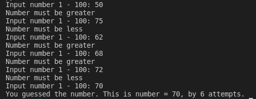
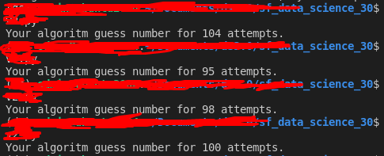
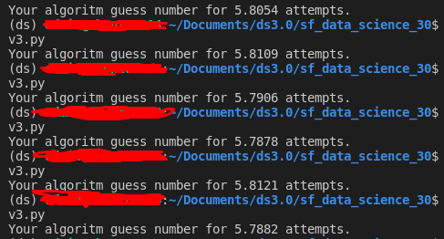

# Проект 0. Угадай число

## Оглавление  
[1. Описание проекта](#Описание-проекта)  
[2. Какой кейс решаем?](#Какой-кейс-решаем)  
[3. Краткая информация о данных](#Краткая-информация-о-данных)  
[4. Этапы работы над проектом](#Этапы-работы-над-проектом)  
[5. Результат](#Результат)  
[6. Выводы](#Выводы)  

### Описание проекта  
Угадать загаданное компьютером число за минимальное число попыток.

:arrow_up:[к оглавлению](#Оглавление)

### Какой кейс решаем?  
Нужно написать программу, которая угадывает число за минимальное число попыток

**Условия соревнования:**  
- Компьютер загадывает целое число от 0 до 100, и нам его нужно угадать. Под «угадать», подразумевается «написать программу, которая угадывает число».
- Алгоритм учитывает информацию о том, больше ли случайное число или меньше нужного нам.

**Метрика качества**  
Результаты оцениваются по среднему количеству попыток при 10000 повторений.

**Что практикуем**  
Учимся писать хороший код на python.

### Краткая информация о данных  
Входные и выходные данные отсутствуют.

:arrow_up:[к оглавлению :arrow_up:](#Оглавление)

### Этапы работы над проектом  
1. Создаем файл [game.py](game.py), где пишем код для угадывания числа человеком путем ввода с консоли.
2. Создаем файл [game_v2.py](game_v2.py), где пишем код для угадывания числа компьютером по алгоритму через random и подсчет среднего количества угадываний.
3. Создаем файл [game_v3.py](game_v3.py), где пишем код для угадывания числа компьютером по оптимизированному алгоритму (методом деления пополам) и подсчет среднего количества угадываний.

:arrow_up:[к оглавлению](#Оглавление)

### Результаты:  
1. Попытки угадывания человеком:  
    
2. Попытки угадывания компьютером через random:  
    
<!-- 3. Попытки угадывания компьютером по оптимизированному алгоритму:  
     -->

:arrow_up:[к оглавлению](#Оглавление)

### Выводы:  
<!-- 1. Реализовали алгоритм по поиску загаданного числа методом деления пополам.  -->
<!-- 1. Научились оформлять код по стандарту PEP8. -->
1. Научились создавать репозитарий и работать с git.
4. Научились оформлять репозитарий путем редактирования файла README.md.
<!-- 5. Реализовали воспроизводимость кода. -->

:arrow_up:[к оглавлению](#Оглавление)

Если информация по этому проекту покажется вам интересной или полезной, то я буду очень вам благодарен, если отметите репозиторий и профиль ⭐️⭐️⭐️-дами